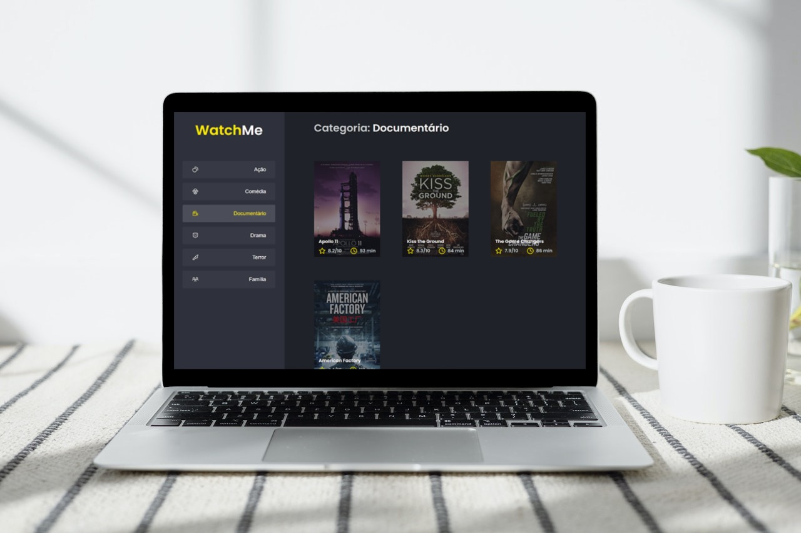

# 🎬 WatchMe

  

### Projeto criado no treinamento Ignite da Rocketseat

## ➡️ Sobre 
Essa é uma aplicação onde o principal objetivo foi usar alguns recursos do React para otimização do App. Como ele pequeno, não compensa usar essas otimizações, porém, é um projeto para aprendizado. Gostei bastante de entender esses novos recursos para mim: memo, useMemo, useCallback e outras formas de otimização do app.

## Para ver um pouco do que foi abordado

Acesse este repositório com algumas anotações?
[ignite-react-performance](https://github.com/pedropaulodf/ignite-react-performance)

## 🚀 Tecnologias 
-   [x] ReactJS (memo, userMemo e useCallback)
-   [x] Typescript
-   [x] Axios
-   [x] json-server
